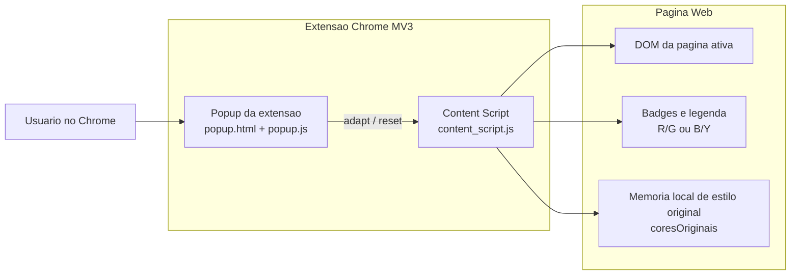
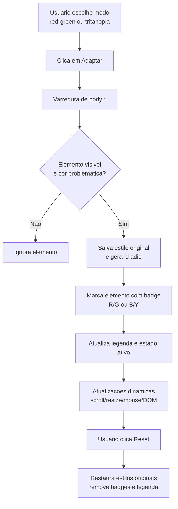

# Diagramas do ADID

## 1. Arquitetura

## 2. Funcionamento (adaptacao e reset)

## 3. Origem das cores usadas em data

### data/dados.csv (base enxuta)

- Contem pares de cores de referencia para teste rapido de acessibilidade.
- Mistura combinacoes classicas de alto contraste e combinacoes propositalmente problematicas para daltonismo vermelho-verde.
- Exemplos:
  - Problematicas: #ff0000 com #00ff00, #ff0000 com #ffffff.
  - Mais seguras: #000000 com #ffffff, #0087be com #ffffff, #ffd700 com #000000.

### data/dados_gerados.csv (base expandida)

- Contem pares adicionais com metricas calculadas: contraste, contraste_deuteranopia, luminancia, distancias de cor e rotulo final de boa acessibilidade.
- Os valores de cores refletem uma paleta ampla de cores conhecidas da web (hexadecimais tipicos de nomes CSS) combinadas para simulacao e classificacao.
- Nao ha, no estado atual deste repositorio, um script versionado de geracao que permita rastrear com exatidao a regra original de amostragem de todas as combinacoes.

### Relacao com a extensao

- A extensao usa regras locais para detectar classes de cor problematica (vermelho/verde e azul/amarelo).
- A paleta segura preferida no content script inclui: #000000, #ffffff, #0087be, #ffd700, #ff4500, #228b22 e #4169e1.
